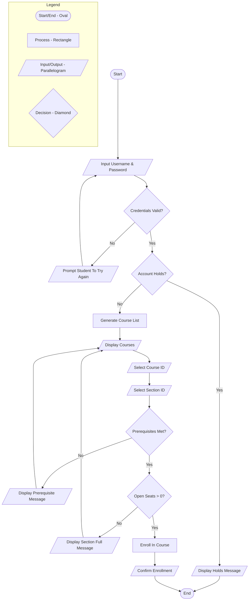

```mermaid
flowchart TD

subgraph Legend
A1([Start/End - Oval])
A2[Process - Rectangle]
A3[/Input/Output - Parallelogram/]
A4{Decision - Diamond}
end

S([Start])
S --> U[/Input Username & Password/]
U --> V{Credentials Valid?}

V -- No --> W[/Prompt Student To Try Again/]
W --> U

V -- Yes --> X{Account Holds?}

X -- Yes --> Y[/Display Holds Message/]
Y --> Z([End])

X -- No --> AA[Generate Course List]
AA --> AB[/Display Courses/]
AB --> AC[/Select Course ID/]
AC --> AD[/Select Section ID/]

AD --> AE{Prerequisites Met?}

AE -- No --> AF[/Display Prerequisite Message/]
AF --> AB

AE -- Yes --> AG{Open Seats > 0?}

AG -- No --> AH[/Display Section Full Message/]
AH --> AB

AG -- Yes --> AI[Enroll In Course]
AI --> AJ[/Confirm Enrollment/]
AJ --> Z
```
