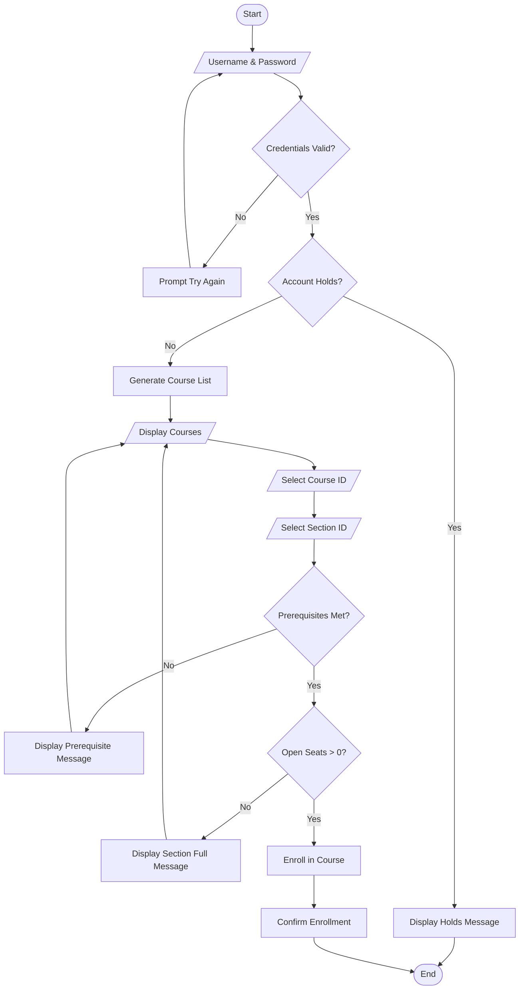

```mermaid
flowchart TD
    A([Start]) --> B[/Username & Password/]
    B --> C{Credentials Valid?}

    C -- No --> D[Prompt Try Again]
    D --> B

    C -- Yes --> E{Account Holds?}

    E -- Yes --> F[Display Holds Message]
    F --> G([End])

    E -- No --> H[Generate Course List]
    H --> I[/Display Courses/]
    I --> J[/Select Course ID/]
    J --> K[/Select Section ID/]

    K --> L{Prerequisites Met?}

    L -- No --> M[Display Prerequisite Message]
    M --> I

    L -- Yes --> N{Open Seats > 0?}

    N -- No --> O[Display Section Full Message]
    O --> I

    N -- Yes --> P[Enroll in Course]
    P --> Q[Confirm Enrollment]
    Q --> G
```
