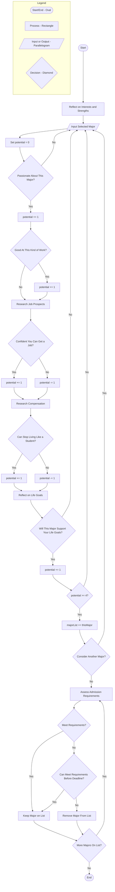

```mermaid
flowchart TD

subgraph Legend
L1([Start/End - Oval])
L2[Process - Rectangle]
L3[/Input or Output - Parallelogram/]
L4{Decision - Diamond}
end

A([Start]) --> B[Reflect on Interests and Strengths]

B --> C[/Input Selected Major/]

C --> D[Set potential = 0]

D --> E{Passionate About This Major?}

E -- No --> C

E -- Yes --> F[potential += 1]

F --> G{Good At This Kind of Work?}

G -- Yes --> H[potential += 1]

G -- No --> I[Research Job Prospects]

H --> I

I --> J{Confident You Can Get a Job?}

J -- Yes --> K[potential += 1]

J -- No --> L[potential -= 1]

K --> M[Research Compensation]

L --> M

M --> N{Can Stop Living Like a Student?}

N -- Yes --> O[potential += 1]

N -- No --> P[potential -= 1]

O --> Q[Reflect on Life Goals]

P --> Q

Q --> R{Will This Major Support Your Life Goals?}

R -- No --> C

R -- Yes --> S[potential += 1]

S --> T{potential >= 4?}

T -- No --> C

T -- Yes --> U[majorList += thisMajor]

U --> V{Consider Another Major?}

V -- Yes --> C

V -- No --> W[Assess Admission Requirements]

W --> X{Meet Requirements?}

X -- Yes --> Y[Keep Major on List]

X -- No --> Z{Can Meet Requirements Before Deadline?}

Z -- Yes --> Y

Z -- No --> AA[Remove Major From List]

Y --> AB{More Majors On List?}

AA --> AB

AB -- Yes --> W

AB -- No --> AC([End])
```
