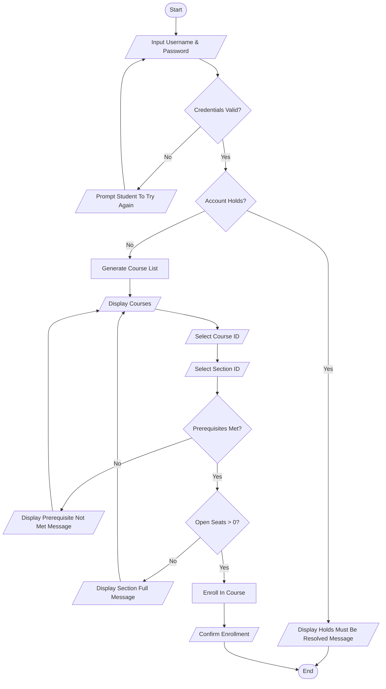

```mermaid
flowchart TD

A([Start])

B[/Input Username & Password/]

C{Credentials Valid?}

D[/Prompt Student To Try Again/]

E{Account Holds?}

F[/Display Holds Must Be Resolved Message/]

G([End])

H[Generate Course List]

I[/Display Courses/]

J[/Select Course ID/]

K[/Select Section ID/]

L{Prerequisites Met?}

M[/Display Prerequisite Not Met Message/]

N{Open Seats > 0?}

O[/Display Section Full Message/]

P[Enroll In Course]

Q[/Confirm Enrollment/]

A --> B
B --> C

C -- No --> D
D --> B

C -- Yes --> E

E -- Yes --> F
F --> G

E -- No --> H
H --> I
I --> J
J --> K

K --> L

L -- No --> M
M --> I

L -- Yes --> N

N -- No --> O
O --> I

N -- Yes --> P
P --> Q
Q --> G
```
